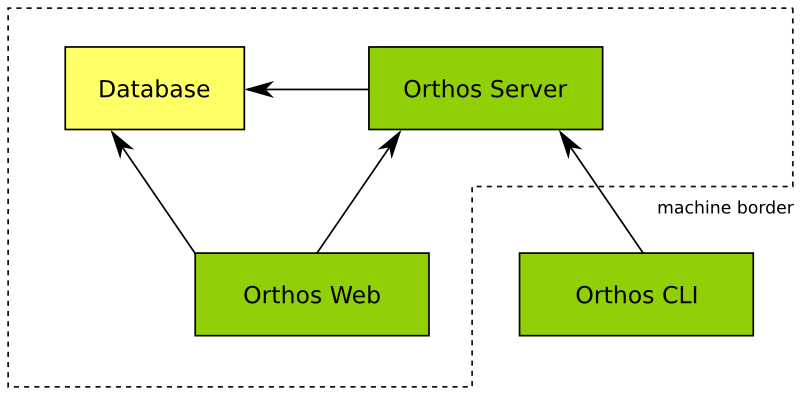
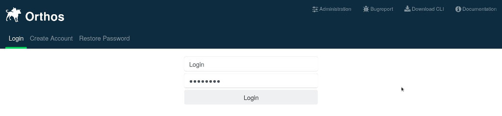
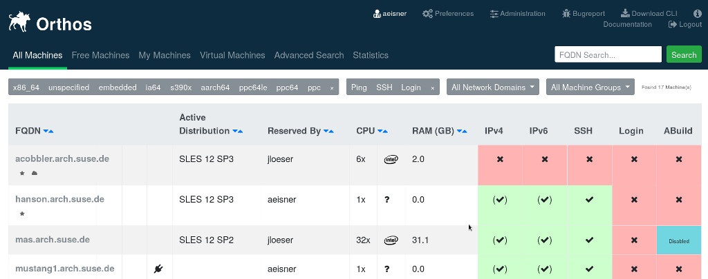
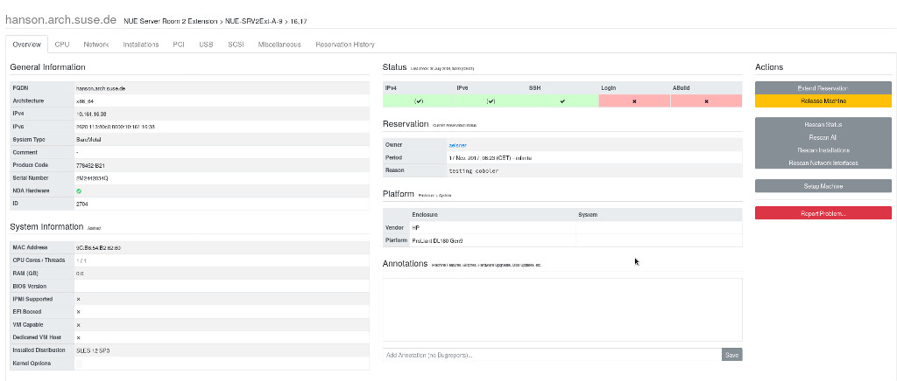
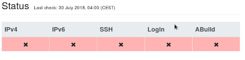
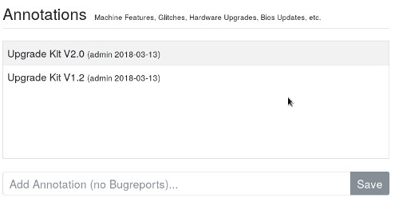
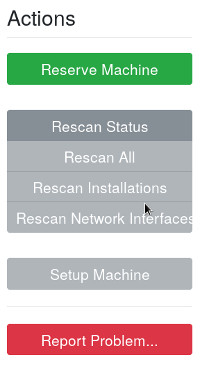
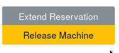
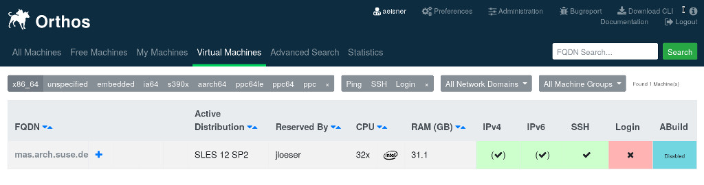
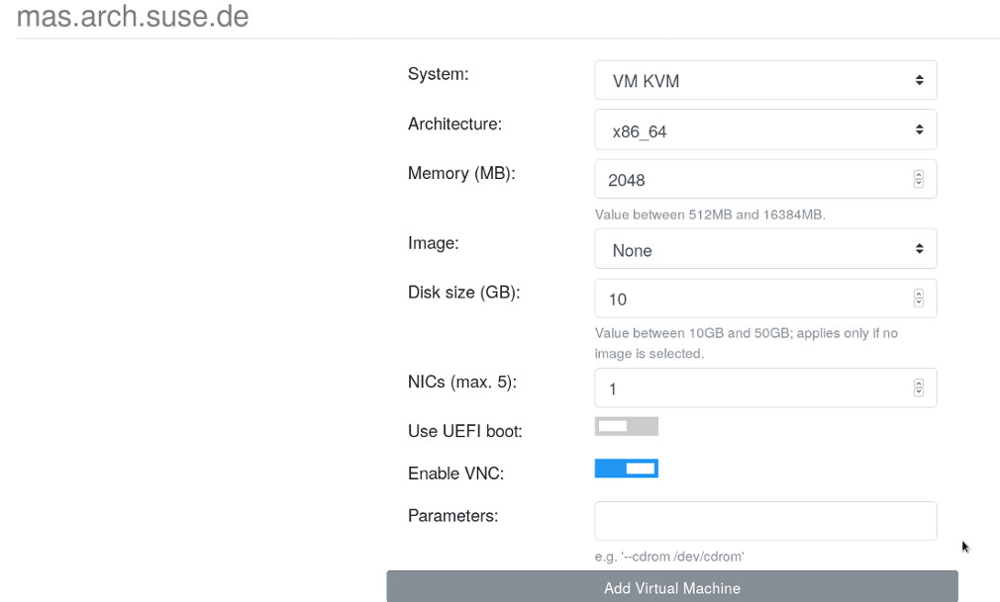

**********
User Guide
**********

Describes how to use Orthos as a user, how to find, save and install machines for your purposes with the help of Web
GUI and the Command Line Interface (CLI).

.. contents::
    :local:

Introduction
############

Orthos is the machine administration tool of the development network in the ARCH team at SUSE. It is used for following
tasks:

- locating a machine,
- getting the state of the machine,
- overview about the hardware,
- overview about the installed software (installations),
- reservation of the machines,
- generating the DHCP configuration,
- reboot the machines remotely and
- managing remote consoles.

This document describes the usage. For implementation specific notes, please refer to the “Developer’s Guide”. However,
sometimes this document describes some aspects of the implementation simply to let the user better understand why things
work as they do. All users of Orthos have a very technical background.

Architecture
############

Image Overall Architecture shows the overall architecture. All data is kept in the database. The Orthos Server is the
central component of Orthos. It has the following tasks:

- gathering machine data,
- communicating with the clients,
- executing jobs such as rebooting or installating the machine or syncing some files.

There are two clients: The command line interface and the web interface. While the web interface is able to deal with
basic tasks such as getting a machine overview and reserving a machine, the CLI is able to deal with more complicated
tasks such as executing queries and even edit the data.

Web Client
##########

Via the link to your webserver domain it is possible to use the Orthos Web Client. The Web Client is mostly
self-explanatory, so only the most important things are explained. You can log in via the web client with an LDAP user
account. This is a normal user and has no administrative rights.This means that it is not possible to create and delete machine objects
yourself and so on. With this account it is possible to use machines.

You can:

- Search for suitable machines
- Reserve machines for you
- Install the machines you need with SLES, SLED, openSUSE Leap and openSUSE tumbleweed,...
- Perform various machine checks
- Get information about machines and test their accessibility
- Add annotations for each machine (Machine Features, Glitches, Hardware Upgrades, Bios Updates, etc.)
- Report Problems for each machine
- Get an overview of the reservation history

If administrative rights are required, they must be set up by an Orthos administrator. Below a screenshot of the login
page.

Landing Page
============

After logging in you will be redirected to the Orthos landing page. Here you will find a direct overview of all machines
that are available in Orthos.

Here different possibilities are available to get to machines or to get an entire machine status.

- All Machines: Overview of all machines that are available in Orthos.
- Free Machines: Overview of all machines that are available in Orthos.
- My Machines: Overview of all Orthos machines reserved under your name.
- Virtual Machines: Overview of all virtual machines. (Host/Gast).
- Advanced Search: Advanced machine search.
- Statistics: Statistics about the machines located in Orthos.

- x86_64, unspecified, embedded, ia64, s390x, ppc64le etc: Sorting by architecture
- Ping, SSH and Login: Sort by availability status.
- All Network Domains: Sort by network domain.
- All Machine Groups: Overview and sorting of machines in the respective machine group.

Machine Page
============

Each machine (machine object) has its own page here you have the possibility to get more detailed information about the
machine, to request the status of a machine, to have machines scanned, to install the machine with a new OS, to open
error tickets and to write annotations to the machines.

Machine Scans, Infos, Actions and Annotations

- Overview: The most important information about a machine, information about the status, possibility to scan the
  machine, to reinstall, to report errors and to write annotations.
- CPU, Network, Installation, PCI, USB, SCSI, Miscellaneous and Reservation History: Detailed information on the
  Subitems.

- IPv4 / IPv6: Ping status of a machine IPv4 and IPv6.
- SSH: Orthos tries if it would be possible to establish an SSH connection.
- Login: If a connection with SSH is possible, Orthos tries if a login is also possible.

The scan behaviour of Orthos can be defined by an administrator for the respective machine object.

Additional machine information should be entered here. For example, upgrades, hardware configuration changes, etc.

- Reserve Machines: Here it is possible to reserve a machine under your name. In general, make sure that machines are only reserved for as long as you actually need them. A maximum of 90 days is planned. Please remember that other users may also need the machine. If you need a machine for a longer period of time, only an Orthos administrator can make reservations under your name for longer time periods, up to infinite for constant machine assignment.
- Rescan Status: Rescan the status information of a machine.
- Rescan All: Rescan all information of a machine.
- Rescan Installations: Resacan the installation status of a machine.
- Rescan Network Interfaces: Rescan the machine network interfaces.
- Setup Machine: Here you can install your machine according to your needs. You have the possibility to install SLES, SLED, Opensuse Leap, Opensuse and Tumbleweed. During the installation you have several options: install, install ssh install ssh auto, install auto etc.
- Report Problem: If you unexpectedly encounter a problem with the machine, you can create a support ticket here.

- Release Machine: This field is only for machines that are reserved under your name. Here you have the possibility to release the machine for other users.

Virtual Machines
================

In Orthos it is possible that you work with virtual machines. You can work with a virtual machine as well as with a
bare metal machine. You can use the Power Cycle and access the console.

Under Virtual Machine select a VM host and click on the plus (+) to create a VM guest.

After Add Virtual Machines the VM host is created and made available under the My Machines

Command Line Interface (CLI)
############################

Basics
======

The Orthos CLI is a simple interactive shell. You can perform following tasks with the Orthos CLI:

- executing complex queries such as “which machines have more than 4 CPUs” and are reserved by Ließchen Müller,
- reserving a machine (only for yourself!),
- viewing detailed machine information (such as dmidecode, lspci, lsmod or hwinfo),
- turning power on/off or just reboot a machine,
- editing machine data.

Install the CLI
===============

Python 3 is recommended, the CLI runs also with python2 but python 2 is untested.

.. code-block::

    zypper ar https://download.opensuse.org/repositories/systemsmanagement/openSUSE_Leap_15.2/ orthos-cli #Eventually adjust the distribution.
    zypper ref
    zypper in orthos-cli

In the Orthos Web Client you will find also the download link ``Download CLI`` to the CLI, here you have the possibility
to download the suitable client for your distribution(.rpm). The button is in the top right corner.

Connecting the CLI to the Orthos Server
=======================================

The CLI has several options how you can set up the connection to the Orthos server and adapt it to your needs.

.. code-block::

    you_machine:~ # orthos-cli --help
    usage: orthos-cli [-h] [-H HOST] [-P PORT] [-U USER] [--password PASSWORD]
                      [--token TOKEN] [-D] [-L FILE] [--no-pager] [-p] [-F IFS]
                      [-q] [-v] [--timezone TZ]

    Orthos command line interface.

    optional arguments:
      -h, --help            show this help message and exit
      -H HOST, --host HOST  use the hostname specified on the command line instead
                            of the one in the config file
      -P PORT, --port PORT  use the port specified on the command line instead of
                            the one in the config file
      -U USER, --user USER  use the username specified
      --password PASSWORD   use this password for automatic authentication (e.g.
                            for scripting)
      --token TOKEN         use this token for automatic authentication (e.g. for
                            scripting); -U/--password options will be ignored
      -D, --debug           write debugging output
      -L FILE, --logfile FILE
                            use that together with -D to log the debug output in a
                            file rather than the console
      --no-pager            do not use pager when showing results
      -p, --plain-output    print plain output (e.g. for scripting)
      -F IFS, --ifs IFS     set internal field separator (only useful in
                            combination with -p; default is $OIFS)
      -q, --quiet           makes command line client quiet
      -v, --version         print version output
      --timezone TZ         set the local time zone (default is "Europe/Berlin")

Example for the connection to the Orthos Server:

.. code-block::

    your_machine:~ # orthos-cli -H https://orthos-next.arch.suse.de
    (orthos 2.0.0)

Orthos commands
===============

HELP

Provides help and shows you an overview of the available Orthos CLI commands.

Example:

.. code-block::

    (orthos 2.0.0) help
    Commands are:

    INFO                 Retrieve information about a machine.
    POWER                Power cycles a machine.
    REGENERATE           Regenerate machine-related or service files.
    RESCAN               Rescan a machine.
    SERVERCONFIG         Show server configuration.
    RESERVATIONHISTORY   Show reservation history of a machine.
    ADD                  Adds information to the database.
    RELEASE              Release machines.
    QUERY                Retrieve information about a machine.
    RESERVE              Reserve machines.
    SETUP                Automatic machine setup.
    DELETE               Removes information from the database.
    ALIAS                Define own aliases.
    AUTH                 Request authorisation manually.
    EXIT                 Exit program.
    HELP                 Provides help.

The HELP can also show you the help for certain commands.

Example:

.. code-block::

    (orthos 2.0.0) help info
    Command to get information about a machine.

    Usage:
        INFO <fqdn>

    Arguments:
        fqdn - FQDN or hostname of the machine.

    Example:
        INFO foo.suse.de

INFO

Retrieve information about a machine.

Command description:

.. code-block::

    (orthos 2.0.0) help info
    Command to get information about a machine.

    Usage:
        INFO <fqdn>

    Arguments:
        fqdn - FQDN or hostname of the machine.

    Example:
        INFO foo.suse.de

POWER

Power cycles a machine.

Command description:

.. code-block::

    (orthos 2.0.0) help power
    Command to power cycle machines or the get the current status.

    Usage:
        POWER <fqdn> <action>

    Arguments:
        fqdn   - FQDN or hostname of the machine.
        action - Specify new power state. Actions are:

    on                 : Power on.
    off                : Power off via SSH. If didn't succeed, use remote power.
    off-ssh            : Power off via SSH only.
    off-remotepower    : Power off via remote power only.
    reboot             : Reboot via SSH. If didn't succeed, use remote power.
    reboot-ssh         : Reboot via SSH only.
    reboot-remotepower : Reboot via remote power only.
    status             : Get power status.

    Example:
        POWER foo.suse.de reboot

REGENERATE

Regenerate machine-related or service files.

Command description:

.. code-block::

    (orthos 2.0.0) help REGENERATE
    Command to regenerate machine-related files or configuration files for various services.

    Usage:
        REGENERATE <fqdn> <option>
        REGENERATE <service>

    Arguments:
        fqdn    - FQDN or hostname of the machine.
        option  - Specify what machine-related file should be regenerated.
                    Options are:

    motd          : Message of the day.

    service - Specify which service configuration file shoud be regenerated.
           Options are:
                 dhcp          : DHCP configuration files (superusers only).
                 serialconsole : Serial console files (superusers only).

    Example:
        REGENERATE foo.suse.de motd
        REGENERATE dhcp

ADD

Adds information to the database.

Command description:

.. code-block::

    (orthos 2.0.0) help add
    Adds items to the database. All information will be queried interactively.

    Usage:
        ADD <item> [args*]

    Arguments:
        item - Specify the item which should be added. Items are:

    machine                       : Add a machine (superusers only).
    annotation <fqdn>             : Add an annotation to a specific
                                    machine (no bugreports).
    serialconsole <fqdn>          : Add a serial console to a specific
                                    machine (superusers only).
    remotepower <fqdn>            : Add a remote power to a specific
                                    machine (superusers only).
    virtualmachine <architecture> : Add a virtual machine on a specific
                                    architecture.

    Example:
        ADD machine
        ADD virtualmachine x86_64
        ADD serialconsole foo.suse.de
        ADD remotepower foo.suse.de
        ADD annotation foo.suse.de

DELETE

Removes information from the database.

Command description:

.. code-block::

    (orthos 2.0.0) help delete
    Deletes items from the database.

    Usage:
        DELETE <item> [args*]

    Arguments:
        item - Specify the item which should be deleted. Items are:

    machine       : Delete a machine (superusers only).
    serialconsole : Delete serial console of a specifc machine
                    (superusers only).
    remotepower   : Delete remote power of a specifc machine
                    (superusers only).

    Example:
        DELETE machine

SERVERCONFIG

Show server configuration.

Command description:

.. code-block::

    (orthos 2.0.0) help serverconfig
    Show server configuration (superusers only).

    Usage:
        CONFIG

    Example:
        CONFIG

RESCAN

Rescan a machine.

Command description:

.. code-block::

    (orthos 2.0.0) help rescan
    Command to rescan machines. Normally all machines are scanned once a day automatically. For some reason it makes sense to rescan machines manually immediately, e.g. if new hardware has been added.

    Usage:
        RESCAN <fqdn> <option>

    Arguments:
        fqdn   - FQDN or hostname of the machine.
        option - Specify what should be rescanned. Options are:

    status            : Check machine status (ping, SSH, login).
    all               : Complete scan.
    misc              : Check miscellaneous software/hardware attributes.
    installations     : Rescan installed distributions only.
    networkinterfaces : Rescan network interfaces only.

    Example:
        RESCAN foo.suse.de networkinterfaces

RESERVE

Reserve machines.

Command description:

.. code-block::

    (orthos 2.0.0) help reserve
    Reserves a machine.

    Usage:
        RESERVE <fqdn>

    Arguments:
        fqdn - FQDN or hostname of the machine.

    Example:
        RESERVE foo.suse.de

RESERVATIONHISTORY

Show reservation history of a machine.

Command description:

.. code-block::

    (orthos 2.0.0) help RESERVATIONHISTORY
    Show reservation history of a machine.

    Usage:
        RESERVATIONHISTORY <machine>

    Arguments:
        machine - FQDN or hostname of the machine.

    Example:
        RESERVATIONHISTORY foo.suse.de

ALIAS

Define own aliases.

Command description:

.. code-block::

    (orthos 2.0.0) help alias
    Define or display aliases. The command can be called without any arguments, then it displays all available aliases. If it's called with one argument, then it displays the definition of a specific alias. If it is called with more than two arguments, then you can define new aliases.

    To execute an alias, type the alias name with a leading '@'.

    Usage:
        ALIAS [alias] [*args]

    Arguments:
        alias - Alias name.
        *args - Valid command string.

    Example:
        ALIAS
        ALIAS allmachines query name, ipv4 where name =~ foobar
        ALIAS allmachines

    @allmachines

AUTH

Request authorisation manually.

Command description:

.. code-block::

    (orthos 2.0.0) auth
    Orthos password for 'your_login_name':*******
    (orthos 2.0.0)

QUERY

Retrieve information about a machine.

Command description:

.. code-block::

    (orthos 2.0.0) help query
    Command to query machines. You can just specify a comma-separated list of fields, then you get that fields for all machines.

    Example:

    QUERY fqdn, cpu_physical
    QUERY fqdn WHERE cpu_model =~ Intel
    QUERY fqdn WHERE cpu_model =~ Intel OR !efi

    Valid operators are:
    ------------------------------------------------------------------------------
    !<field>            not
    == =                exactly equal
    =~                  contains
    =*                  startswith
    !=                  unequal
    >  <                greater or less than (numbers only)
    >= <=               greater equals or less equals (numbers only)
    AND                 logical conjunction
    OR                  logical disjunction
    ------------------------------------------------------------------------------

Orthos Variables and Objects
============================

The Orthos Client has many objects that you can query from the machine objects in Orthos. The names are always
self-explanatory and can be used for queries as described above under the QUERY command.

- A: active, administrative, annotation_created, annotation_reporter, annotation_text, architecture
- B: bios_version, bios_date
- C: check_connectivity, collect_system_information, comment, contact_email, cpu_cores, cpu_flags, cpu_id,
  cpu_model, cpu_physical, cpu_speed, cpu_threads, created
- D: dhcp_filename, disk_primary_size, disk_type, dmesg, dmidecode, domain
- E: efi, enclosure, enclosure_platform, enclosure_vendor
- F: fqdn, fqdn_domain
- G: group
- H: hwinfo
- I: id, iface_driver_module, iface_ethernet_type, iface_mac_address, iface_name, iface_primary, infinite, inst_active,
  inst_arch, inst_dist, inst_kernel, inst_partition, ipmi, ipv4, ipv6
- K: kernel_options
- L: last, last_check, lsmod, lspci, lsscsi, lsusb
- N: name
- P: pci_classid, pci_classname, pci_device, pci_deviceid, pci_driver, pci_revision, pci_sdeviceid, pci_sdevicename,
  pci_slot, pci_svendorid, pci_svendorname, pci_vendor, pci_vendorid, platform, product_code
- R: ram, ram_amount, res_by, reserved_at, reserved_by, reserved_by_email, reserved_reason, reserved_until, rpower,
  rpower_device, rpower_management_bmc, rpower_port, rpower_power_device, rpower_type
- S: sconsole, serial_baud, serial_command, serial_comment, serial_console_server, serial_cscreen_server, serial_device,
  serial_kernel_device, serial_management_bmc, serial_number, serial_port, serial_type, status_abuild, status_ipv4,
  status_ipv6, status_login, status_ping, status_ssh, system
- U: updated
- V: virtualization_api, vm_auto_delete, vm_capable, vm_dedicated_host, vm_max

