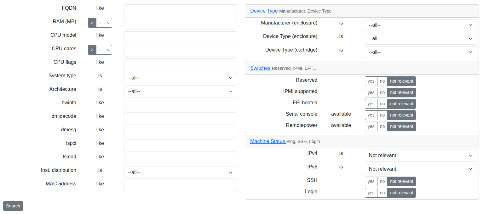

****************************************
Advanced Search
****************************************

The Advanced Search page lets you filter machines by a wide range of hardware, software and status criteria at
once, beyond what the Quick Filters on the machine list pages offer.

You can search by:

- Manufacturer, Device Type (including Cartridge/Blade type), System, Architecture
- FQDN, CPU model, CPU flags, CPU cores (with a >, = or < comparison), RAM amount (with a >, = or < comparison)
- Hardware/software scan output: ``hwinfo``, ``dmidecode``, ``dmesg``, ``lspci``, ``lsmod``
- Installed distribution
- Whether the machine is reserved, has IPMI, has EFI, has a serial console or has a remote power device configured
- Network interface MAC address
- Ping, SSH and Login status

Search results are shown using the same machine list you already know from the other machine overviews, see
:doc:`landing_page`.
