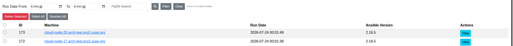

****************************************
Ansible Results
****************************************

.. note:: This page is only visible to you if you have administrator rights.

The Ansible Results page lists the results of Ansible checks that have been run against machines.

- Machine: The machine the check was run against.
- Run Date: When the check was executed.
- Ansible Version: The Ansible version used for the run.

You can filter by machine, a date range, or search by machine FQDN. Results can be deleted individually or in bulk,
or re-applied to a machine.
