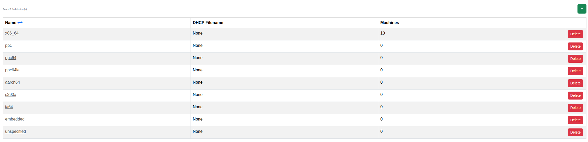

****************************************
Architectures
****************************************

.. note:: This page is only visible to you if you have administrator rights.

Architectures represent the CPU architectures known to Orthos 2 (e.g. x86_64, aarch64, s390x). This page lists the
configured architectures.

- Name: The architecture's name.
- DHCP Filename: The PXE boot filename served for this architecture.
- Machines: Number of machines using this architecture.

An architecture that is still in use by a machine cannot be deleted. See :doc:`../adminguide/architectures` for the
full field reference.
