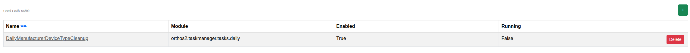

****************************************
Daily Tasks
****************************************

.. note:: This page is only visible to you if you have administrator rights.

Daily Tasks are recurring background jobs processed by the Orthos 2 Taskmanager on a schedule. This page lists and
manages them.

- Name: The task's name.
- Module: The Python module implementing the task.
- Enabled: Whether the task is currently scheduled to run.
- Running: Whether the task is currently executing.

You can force a task to run on its next poll, enable/disable it, or clear a stuck "Running" flag from this page.
