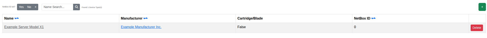

****************************************
Device Types
****************************************

The Device Types page lists every hardware device type known to Orthos 2, most of which are synchronized from
NetBox.

- Name: The device type's name.
- Manufacturer: The manufacturer this device type belongs to.
- Cartridge/Blade: Whether this device type is a cartridge or blade system.
- NetBox ID: The linked NetBox object, if any.

You can filter the list by name, or by whether a device type is linked to NetBox.

Administrators can add, edit or delete a device type. Once a device type is linked to NetBox, its name and
description can no longer be edited manually.
