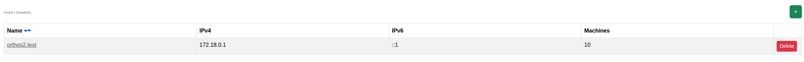
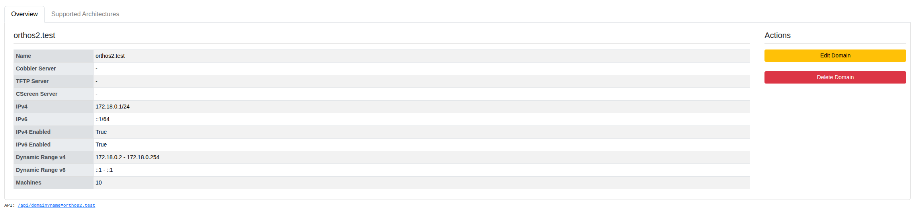

****************************************
Domains
****************************************

.. note:: This page is only visible to you if you have administrator rights.

Domains represent the network domains Orthos 2 manages, including their Cobbler/TFTP servers, IP ranges and DNS
settings. This page lists them.

- Name: The domain's name.
- IPv4 / IPv6: The domain's configured IP ranges.
- Machines: Number of machines in this domain.

Clicking a domain's name opens its detail page, showing the full field reference (Cobbler/TFTP/CScreen servers,
IPv4/IPv6 ranges and whether they're enabled, dynamic ranges, and machine count) alongside Edit and Delete actions,
plus a "Supported Architectures" tab for per-domain architecture settings.

A domain that is still in use by a machine cannot be deleted. See :doc:`../adminguide/domains` for the full field
reference.
