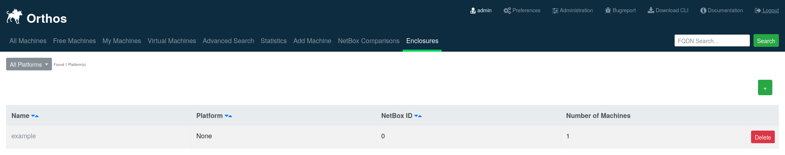
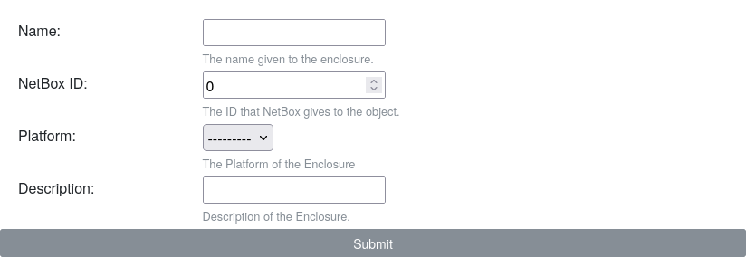
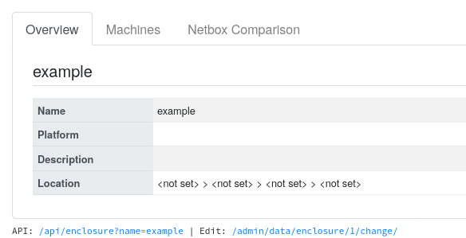
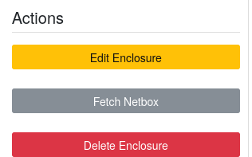
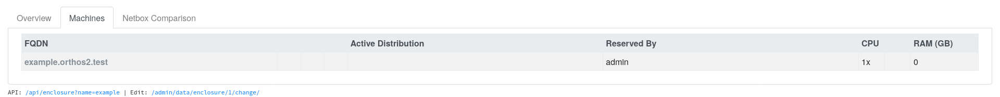
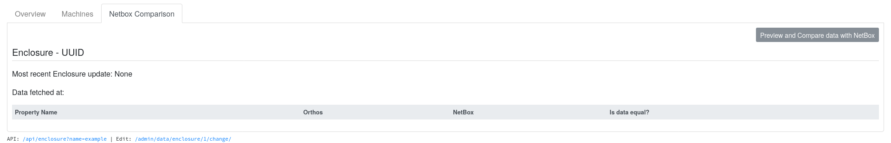

**************
Enclosure Page
**************

The concept of an Enclosure was create so that multi-node machines can be handled accordingly in Orthos 2. This means
that a single physical chassis has one or more exchangable bays that can accomodate physical servers. An example of such
a system would Fujitsu Primergy Blade Servers where one chassis can take a dozen (or more) blades.

List View
#########

This page will show a list of all enclosures and allow you to delete individual servers if desired. The quick filter
allows you to display only servers of a specific Platform. The green plus button on the top right can be used to
navigate to the add view.

Add View
########

The add view is reused to edit enclosures as well and takes the name, NetBox ID and optionally a Platform and
Description. In case the NetBox ID is different to zero, Orthos 2 will try to fetch the location and description from
a NetBox "Device" object. In case the containing Orthos 2 Machines are NetBox "Virtual Machines", please use the ID of
the NetBox "Device" which hosts the cluster. If a NetBox Virtual Machine Cluster consists of multiple host nodes, this
mapping will not make sense anymore and it is better to leave the NetBox ID at its default of zero.

Details View
############

Overview
========

Here the name, Platform, description and location can be seen. On the bottom of the tab the link for the HTTP API and
Django Admin can be seen.

Actions
=======

These are the actions that can be performed with an Enclosure. They are as follows at the moment:

- Edit: Edit the currently visible Enclosure with the help of the add view.
- Fetch NetBox: Fetch all data from NetBox and overwrite data that is currently present in NetBox.
- Delete Enclosure: Delete the currently visible enclosure from the system. This means that linked machines and their
  sub-items are deleted as well.

Machines
========

This page lists all machines along with their currently installed distribution, reservation user, CPU cores and RAM.
The name of the machine is a hyperlink to the detail page.

NetBox Comparison
=================

This page shows the latest attempt at comparing the data of Orthos 2 and NetBox. To display if the data in the Orthos 2
column is the current one, the last fetch attempt is displayed.
