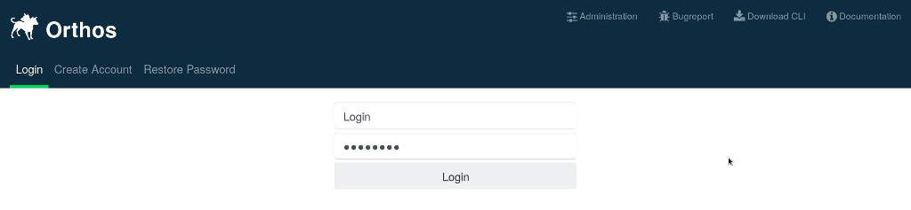

*******
General
*******

Introduction
############

Orthos is the machine administration tool of the development network in the ARCH team at SUSE. It is used for following
tasks:

- locating a machine,
- getting the state of the machine,
- overview about the hardware,
- overview about the installed software (installations),
- reservation of the machines,
- generating the DHCP configuration,
- reboot the machines remotely and
- managing remote consoles.

This document describes the usage. For implementation specific notes, please refer to the “Developer’s Guide”. However,
sometimes this document describes some aspects of the implementation simply to let the user better understand why things
work as they do. All users of Orthos have a very technical background.

Architecture
############

.. note:: The CLI is deprecated. The main interface to be used should be the Web UI.

.. image:: ../img/userguide/00_architecture.png
  :alt: Orthos2 High-Level Architecture

Image Overall Architecture shows the overall architecture. All data is kept in the database. The Orthos Server is the
central component of Orthos. It has the following tasks:

- gathering machine data,
- communicating with the clients,
- executing jobs such as rebooting or installating the machine or syncing some files.

There are two clients: The command line interface and the web interface. While the web interface is able to deal with
basic tasks such as getting a machine overview and reserving a machine, the CLI is able to deal with more complicated
tasks such as executing queries and even edit the data.

Web Client
##########

Via the link to your webserver domain it is possible to use the Orthos Web Client. The Web Client is mostly
self-explanatory, so only the most important things are explained. You can log in via the web client with an LDAP user
account. This is a normal user and has no administrative rights.This means that it is not possible to create and delete machine objects
yourself and so on. With this account it is possible to use machines.

You can:

- Search for suitable machines
- Reserve machines for you
- Install the machines you need with SLES, SLED, openSUSE Leap and openSUSE tumbleweed,...
- Perform various machine checks
- Get information about machines and test their accessibility
- Add annotations for each machine (Machine Features, Glitches, Hardware Upgrades, Bios Updates, etc.)
- Report Problems for each machine
- Get an overview of the reservation history

If administrative rights are required, they must be set up by an Orthos administrator. Below a screenshot of the login
page.

.. note:: Account creation and password restoration may be disabled in case LDAP authentation is configured.

