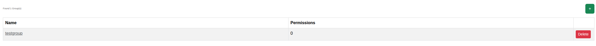

****************************************
Groups
****************************************

.. note:: This page is only visible to you if you have administrator rights.

The Groups page lets administrators manage permission groups and assign granular administrative rights to them.

- Name: The group's name.
- Permissions: The permissions assigned to this group.

Users can be added to groups from their own detail page under :doc:`users`. See
:doc:`../adminguide/groups_and_users` for background on the permission model.
