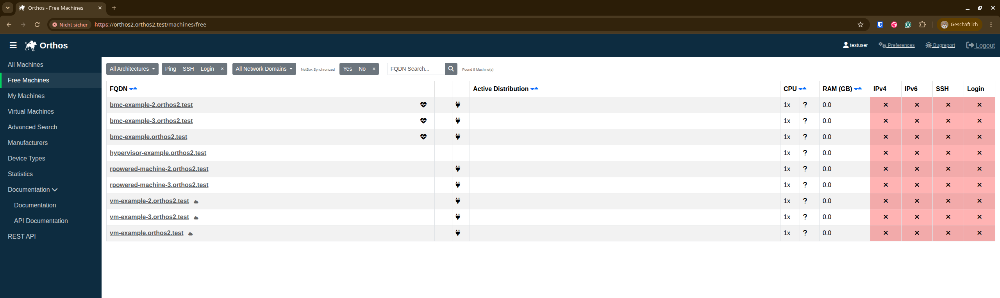
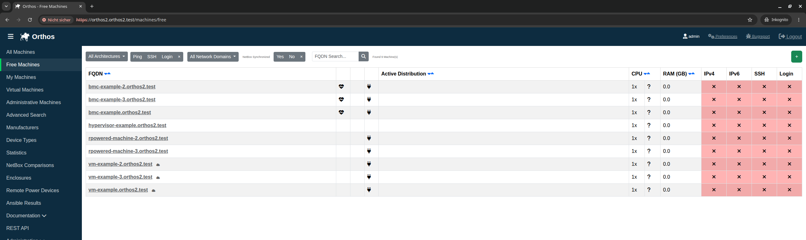
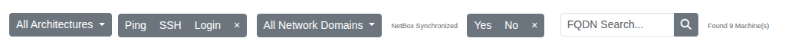

************
Landing Page
************

After logging in you will be redirected to the Orthos landing page. Here you will find a direct overview of all machines
that are available in Orthos.

Administrators see a few additional entries in the sidebar, and an "Add Machine" button above the machine table:

Sidebar Navigation
##################

.. image:: ../img/userguide/03_sidebar_navigation.png
  :alt: Orthos2 Sidebar Navigation (administrator, all entries expanded)
  :align: right

The sidebar on the left gives access to the different machine overviews and tools:

- All Machines: Overview of all machines that are available in Orthos.
- Free Machines: Overview of all machines that are currently not reserved and not a dedicated VM host.
- My Machines: Overview of all Orthos machines reserved under your name.
- Virtual Machines: Overview of all virtual machines. (Host and Guest)
- :doc:`advanced_search`: Advanced machine search.
- :doc:`manufacturers`: Overview of the known hardware manufacturers.
- :doc:`devicetypes`: Overview of the known device types.
- :doc:`statistics`: Statistics about the machines located in Orthos.
- Documentation / API Documentation: Links to this documentation and the REST API documentation.
- REST API: Browsable REST API.

Administrators additionally see:

- :doc:`administrative_machines`: Overview of machines flagged for administrative purposes. (Only visible with Admin
  Permissions.)
- NetBox Comparisons: Check the comparison logs between Orthos 2 and NetBox. (Only visible with Admin Permissions.)
  See :doc:`netbox_comparison_page`.
- Enclosures: Create, View, Edit and Delete Enclosures of Orthos 2. (Only visible with Admin Permissions.) See
  :doc:`enclosure_page`.
- :doc:`remote_power_devices`: Overview of the configured Remote Power Devices. (Only visible with Admin
  Permissions.)
- :doc:`ansible_results`: Overview of Ansible run results. (Only visible with Admin Permissions.)
- Administration: A collapsible menu section (not the Django administration backend) that expands in place to reveal
  further administrative pages. (Only visible with Admin Permissions.) It links to:

  - :doc:`serial_console_types`
  - :doc:`systems`
  - :doc:`remote_power_types`
  - :doc:`architectures`
  - :doc:`server_configuration`
  - :doc:`single_tasks`
  - :doc:`daily_tasks`
  - :doc:`domains`
  - :doc:`users`
  - :doc:`tokens`
  - :doc:`groups`
  - :doc:`oidc_diagnostics`

The "Add Machine" button above the machine table lets administrators add a machine directly from NetBox, see
:doc:`machine_add`.

Quick Filters
#############

- All Architectures: Filter machines by architecture (x86_64, embedded, s390x, ppc64le, etc.).
- Ping, SSH and Login: Filter by availability status.
- All Network Domains: Filter by network domain.
- NetBox Synchronized: Filter by whether the machine is synchronized with NetBox.
- FQDN Search: Search machines by (partial) FQDN.
