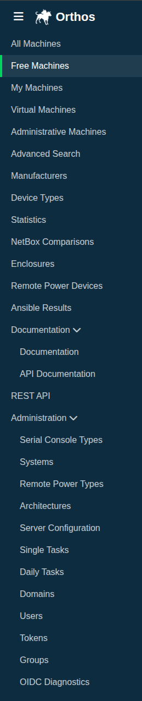

************
Landing Page
************

After logging in you will be redirected to the Orthos landing page. Here you will find a direct overview of all machines
that are available in Orthos.

.. image:: ../img/userguide/02_landingpage_user.png
  :alt: Orthos2 Landing Page (regular user)

Administrators see a few additional entries in the sidebar, and an "Add Machine" button above the machine table:

.. image:: ../img/userguide/02_landingpage_admin.png
  :alt: Orthos2 Landing Page (administrator)

Sidebar Navigation
##################

The sidebar on the left gives access to the different machine overviews and tools:

- All Machines: Overview of all machines that are available in Orthos.
- Free Machines: Overview of all machines that are currently not reserved.
- My Machines: Overview of all Orthos machines reserved under your name.
- Virtual Machines: Overview of all virtual machines. (Host and Guest)
- Advanced Search: Advanced machine search.
- Manufacturers: Overview of the known hardware manufacturers.
- Device Types: Overview of the known device types.
- Statistics: Statistics about the machines located in Orthos.
- Documentation / API Documentation: Links to this documentation and the REST API documentation.
- REST API: Browsable REST API.

Administrators additionally see:

- Administrative Machines: Overview of machines flagged for administrative purposes. (Only visible with Admin Permissions.)
- NetBox Comparisons: Check the comparison logs between Orthos 2 and NetBox. (Only visible with Admin Permissions.)
- Enclosures: Create, View, Edit and Delete Enclosures of Orthos 2. (Only visible with Admin Permissions.)
- Remote Power Devices: Overview of the configured Remote Power Devices. (Only visible with Admin Permissions.)
- Ansible Results: Overview of Ansible run results. (Only visible with Admin Permissions.)
- Administration: Access to the Django administration backend. (Only visible with Admin Permissions.) It links directly
  to:

  - Serial Console Types
  - Systems
  - Remote Power Types
  - Architectures
  - Server Configuration
  - Single Tasks
  - Daily Tasks
  - Domains
  - Users
  - Tokens
  - Groups
  - OIDC Diagnostics

The "Add Machine" button above the machine table lets administrators add a machine directly from NetBox, see
:doc:`machine_add`.

Quick Filters
#############

.. image:: ../img/userguide/04_arch_quickfilter.png
  :alt: Orthos2 Quick Filters

- All Architectures: Filter machines by architecture (x86_64, embedded, s390x, ppc64le, etc.).
- Ping, SSH and Login: Filter by availability status.
- All Network Domains: Filter by network domain.
- NetBox Synchronized: Filter by whether the machine is synchronized with NetBox.
- FQDN Search: Search machines by (partial) FQDN.
