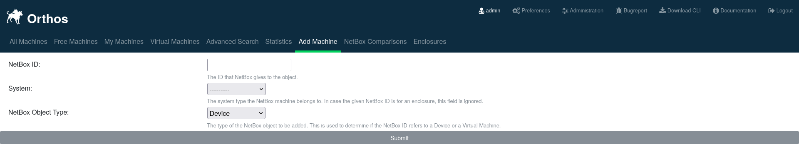

***********
Machine Add
***********

.. note:: The tab "Add Machine" can only be used for people with administrative capabilities. For this to work a NetBox
          instance has to be connected to Orthos 2 beforehand in the backend.

This feature is meant as a shortcut for adding new machines into Orthos 2 that are primarily recorded in NetBox. To add
a machine fill in the NetBox ID, System type and choose between "Device" and "Virtual Machine". The NetBox ID can be
found in the URL of the object in NetBox.
