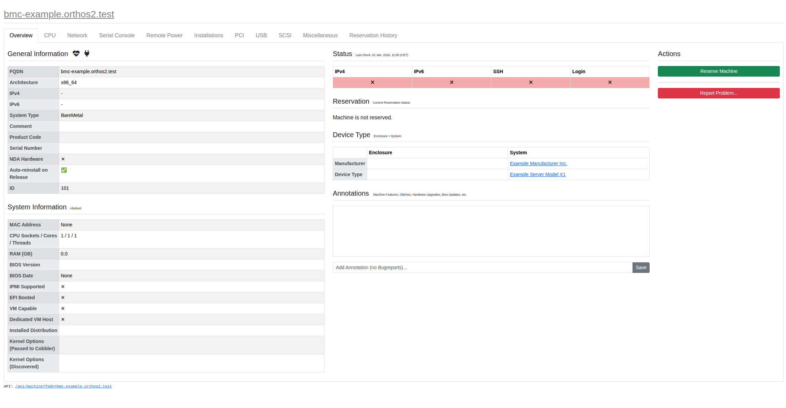
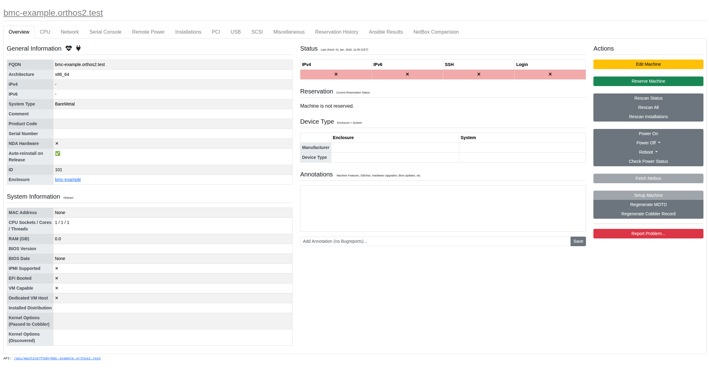
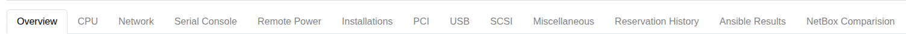
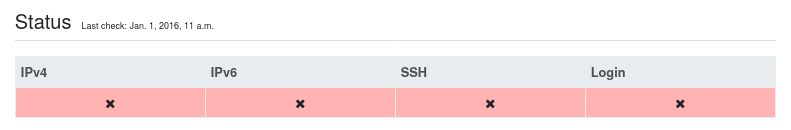
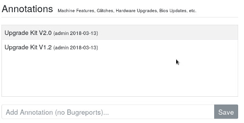
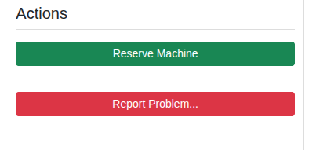
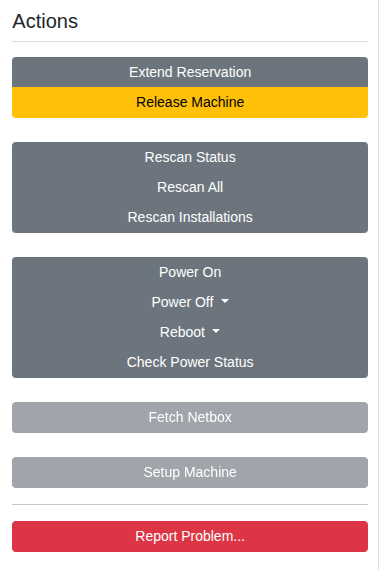
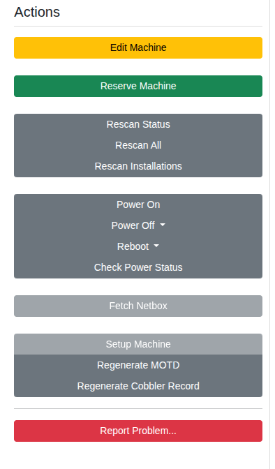

************
Machine Page
************

Each machine (machine object) has its own page here you have the possibility to get more detailed information about the
machine, to request the status of a machine, to have machines scanned, to install the machine with a new OS, to open
error tickets and to write annotations to the machines.

Administrators see additional tabs and actions, such as editing the machine, power control, and NetBox/Cobbler
maintenance actions:

Tabs
####

- Overview: The most important information about a machine, information about the status, possibility to scan the
  machine, to reinstall, to report errors and to write annotations.
- CPU, Network, Serial Console, Remote Power, Installations, PCI, USB, SCSI, Miscellaneous and Reservation History:
  Detailed information on the respective subitem.
- Ansible Results: Results of the Ansible checks run against the machine. (Only visible with Admin Permissions.)
- NetBox Comparison: This page compares the data between Orthos 2 and NetBox. (Only visible with Admin Permissions.)

Status
######

- IPv4 / IPv6: Ping status of a machine IPv4 and IPv6.
- SSH: Orthos tries if it would be possible to establish an SSH connection.
- Login: If a connection with SSH is possible, Orthos tries if a login is also possible.

The scan behaviour of Orthos can be defined by an administrator for the respective machine object.

Annotations
###########

Additional machine information should be entered here. For example, upgrades, hardware configuration changes, etc.

Machine Actions
###############

Before reserving a machine, a regular user only sees the Reserve Machine and Report Problem actions:

- Reserve Machine: Here it is possible to reserve a machine under your name. In general, make sure that machines are
  only reserved for as long as you actually need them. A maximum of 90 days is planned. Please remember that other users
  may also need the machine. If you need a machine for a longer period of time, only an Orthos administrator can make
  reservations under your name for longer time periods, up to infinite for constant machine assignment.
- Report Problem: If you unexpectedly encounter a problem with the machine, you can create a support ticket here.

Once you have reserved the machine yourself, several more actions become available:

- Extend Reservation: Extend your existing reservation.
- Release Machine: Release the machine again so other users may reserve it.
- Rescan Status: Rescan the status information of a machine.
- Rescan All: Rescan all information of a machine.
- Rescan Installations: Rescan the installation status of a machine.
- Power On, Power Off, Reboot, Check Power Status: Control and query the machine's remote power state.
- Fetch NetBox, Setup Machine: Shown but disabled; these remain administrator-only actions even for the reserving
  user.

Administrators see all actions enabled, plus a few administrator-only ones, regardless of who has the machine
reserved:

- Edit Machine: Edit the machine's fields directly.
- Fetch NetBox: Fetch all data from NetBox and overwrite machine data in Orthos 2.
- Setup Machine: Here you can install your machine according to your needs. You have the possibility to install SLES,
  SLED, openSUSE Leap and openSUSE Tumbleweed. During the installation you have several options: install, install ssh
  install ssh auto, install auto etc.
- Regenerate MOTD: Regenerate the machine's message of the day.
- Regenerate Cobbler Record: Regenerate the machine's Cobbler configuration.
