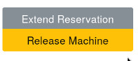

************
Machine Page
************

Each machine (machine object) has its own page here you have the possibility to get more detailed information about the
machine, to request the status of a machine, to have machines scanned, to install the machine with a new OS, to open
error tickets and to write annotations to the machines.

.. image:: ../img/userguide/05_machine_page.jpg
  :alt: Orthos2 Machine Overview Page

Machine Scans, Infos, Actions and Annotations

.. image:: ../img/userguide/06_machine_infos.jpg
  :alt: Orthos2 Machine Details Tabs

- Overview: The most important information about a machine, information about the status, possibility to scan the
  machine, to reinstall, to report errors and to write annotations.
- CPU, Network, Installation, PCI, USB, SCSI, Miscellaneous and Reservation History: Detailed information on the
  Subitems.

.. image:: ../img/userguide/07_machine_status.jpg
  :alt: Orthos2 Machine Overview - Crop on Network Status

- IPv4 / IPv6: Ping status of a machine IPv4 and IPv6.
- SSH: Orthos tries if it would be possible to establish an SSH connection.
- Login: If a connection with SSH is possible, Orthos tries if a login is also possible.

The scan behaviour of Orthos can be defined by an administrator for the respective machine object.

.. image:: ../img/userguide/08_machine_annotations.jpg
  :alt: Orthos2 Machine Overview - Crop on Annotations

Additional machine information should be entered here. For example, upgrades, hardware configuration changes, etc.

.. image:: ../img/userguide/09_machine_actions.jpg
  :alt: Orthos2 Machine Overview - Crop on Actions

- Reserve Machines: Here it is possible to reserve a machine under your name. In general, make sure that machines are only reserved for as long as you actually need them. A maximum of 90 days is planned. Please remember that other users may also need the machine. If you need a machine for a longer period of time, only an Orthos administrator can make reservations under your name for longer time periods, up to infinite for constant machine assignment.
- Rescan Status: Rescan the status information of a machine.
- Rescan All: Rescan all information of a machine.
- Rescan Installations: Resacan the installation status of a machine.
- Rescan Network Interfaces: Rescan the machine network interfaces.
- Setup Machine: Here you can install your machine according to your needs. You have the possibility to install SLES, SLED, Opensuse Leap, Opensuse and Tumbleweed. During the installation you have several options: install, install ssh install ssh auto, install auto etc.
- Report Problem: If you unexpectedly encounter a problem with the machine, you can create a support ticket here.

- Release Machine: This field is only for machines that are reserved under your name. Here you have the possibility to release the machine for other users.
