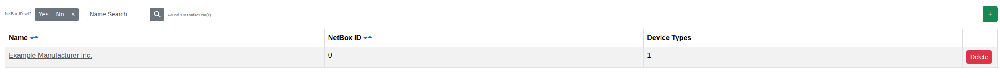

****************************************
Manufacturers
****************************************

The Manufacturers page lists every hardware manufacturer known to Orthos 2, most of which are synchronized from
NetBox.

- Name: The manufacturer's name.
- NetBox ID: The linked NetBox object, if any.
- Device Types: Link to the Device Types belonging to this manufacturer.

You can filter the list by name, or by whether a manufacturer is linked to NetBox.

Administrators can add, edit or delete a manufacturer. Once a manufacturer is linked to NetBox, its name can no
longer be edited manually.
