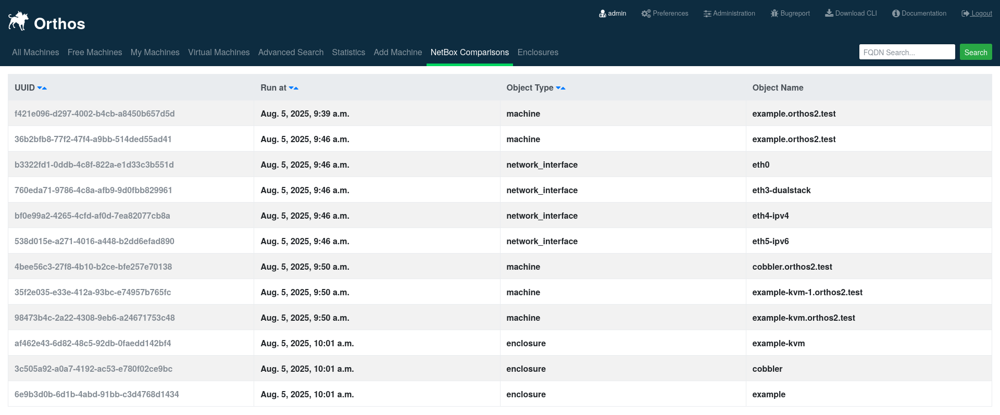
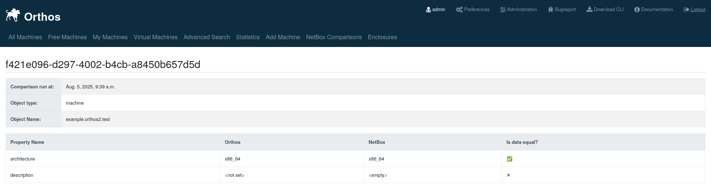

**********************
NetBox Comparison Page
**********************

The concept of NetBox Comparisons was created to track the differences between a data model in Orthos 2 and NetBox at
the comparison point. This was introduced to help detect differences between Orthos 2 and NetBox records, before the
nightly pull-based data sync overwrites the data in Orthos2.

.. note:: Comparison results are deleted after two weeks at the moment to save space in the database.

.. note:: This page is only visible to you if you have administrator rights.

List View
#########

This page provides a list of comparison runs between Orthos 2 and NetBox.

Detail View
###########

This page provides a detail view of a single comparison for a single object.
