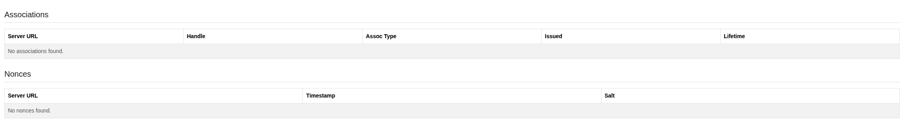

****************************************
OIDC Diagnostics
****************************************

.. note:: This page is only visible to you if you have administrator rights.

OIDC Diagnostics is a read-only troubleshooting page for the OIDC login handshake. It shows the bookkeeping tables
used internally during authentication and isn't otherwise used by Orthos 2.

- Associations: Server URL, Handle, Assoc Type, Issued and Lifetime for each OIDC association.
- Nonces: Server URL, Timestamp and Salt for each OIDC nonce.
