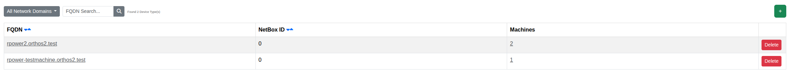

****************************************
Remote Power Devices
****************************************

.. note:: This page is only visible to you if you have administrator rights.

Remote Power Devices are shared power distribution units (PDUs) or similar devices that control power for multiple
machines. This page lists the ones known to Orthos 2.

- FQDN: The remote power device's FQDN.
- NetBox ID: The linked NetBox object, if any.
- Machines: Number of machines whose power is controlled by this device.

Adding a device only requires its NetBox ID plus login credentials and URL; FQDN, IP addresses, MAC address, fence
agent and architecture are then fetched automatically from NetBox. See :doc:`../adminguide/remote_power_device` for
background on the underlying model.
