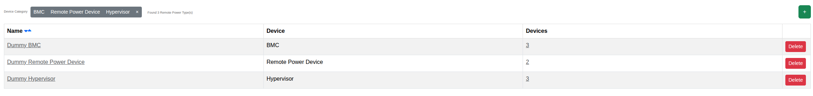

****************************************
Remote Power Types
****************************************

.. note:: This page is only visible to you if you have administrator rights.

Remote Power Types describe the fence agent used to control power for a given device kind (BMC, Remote Power
Device, or Hypervisor). This page lists the configured types.

- Name: The remote power type's name.
- Device: Which kind of device this type applies to (BMC, Remote Power Device, or Hypervisor).
- Devices: Number of devices using this type.

You can filter the list by device kind. See :doc:`../adminguide/remote_power_type` for the fence agent concepts and
field reference.
