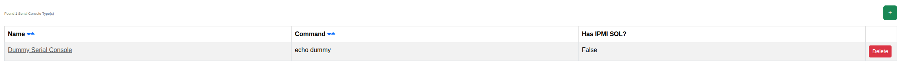

****************************************
Serial Console Types
****************************************

.. note:: This page is only visible to you if you have administrator rights.

Serial Console Types define how Orthos 2 talks to a machine's serial console. This page lists the configured types.

- Name: The serial console type's name.
- Command: The command template used to open a console session.
- Has IPMI SOL?: Whether this type uses IPMI Serial-over-LAN.

See :doc:`../adminguide/serial_console_type` for background and examples (IPMI, ILO2, Telnet, libvirt).
