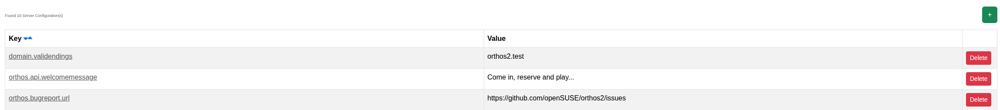

****************************************
Server Configuration
****************************************

.. note:: This page is only visible to you if you have administrator rights.

This page lets administrators manage the database-backed ``ServerConfig`` key/value settings at runtime, without
editing files on the server.

- Key: The setting's key.
- Value: The setting's current value.

See :doc:`../adminguide/server_configuration` for the full list of supported keys, their defaults and examples.
