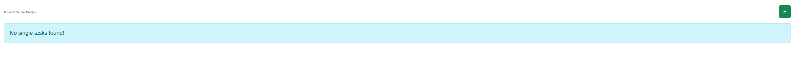

****************************************
Single Tasks
****************************************

.. note:: This page is only visible to you if you have administrator rights.

Single Tasks are one-off background jobs processed by the Orthos 2 Taskmanager. This page lists and lets you queue
them manually.

- Name: The task's name.
- Module: The Python module implementing the task.
- Running: Whether the task is currently executing.

If the Taskmanager process was killed while a task was running, you can manually clear a stuck "Running" flag from
this page.
