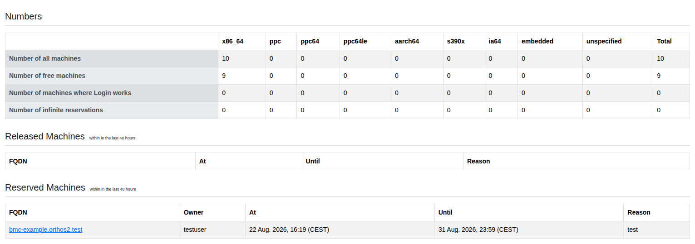
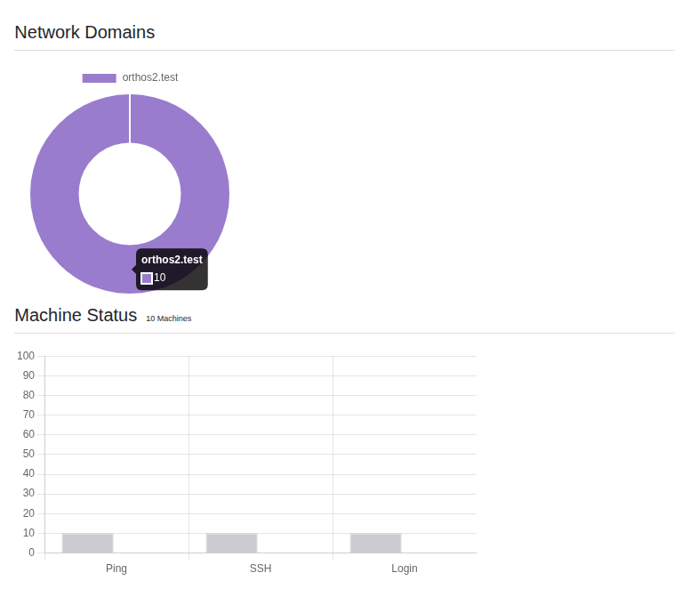

****************************************
Statistics
****************************************

The Statistics page gives you an overview of the current machine inventory and recent reservation activity.

- Numbers: Total machines, free machines, machines with a working login and machines with an infinite reservation,
  broken down per architecture.
- Released Machines: Machines released within the last 48 hours, with reservation reason and timeframe.
- Reserved Machines: Machines reserved within the last 48 hours, with owner, reason and timeframe.

Two charts complement the tables above: one comparing checked-for vs. actually working Ping/SSH/Login status, and
one showing the machine count per network domain.
