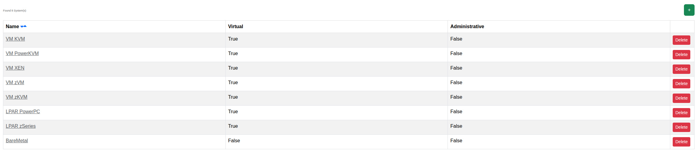

****************************************
Systems
****************************************

.. note:: This page is only visible to you if you have administrator rights.

System types describe what kind of machine a Machine object represents (bare metal, a specific virtualization
platform, an LPAR, ...) and which capabilities that implies. This page lists the configured system types.

- Name: The system type's name.
- Virtual: Whether machines of this type are virtual machines (and may therefore have a hypervisor).
- Administrative: Whether machines of this type are administrative (excluded from installation/reservation).

Editing a system type also lets you set whether it may serve as a dedicated VM host ("Allow Hypervisor") or may have
a BMC assigned ("Allow BMC"). See :doc:`../adminguide/systems_and_enclosures` for background.
