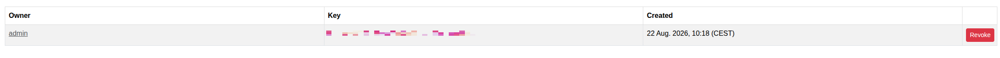

****************************************
Tokens
****************************************

.. note:: This page is only visible to you if you have administrator rights.

The Tokens page gives administrators an overview of every API token issued to a user.

- Owner: The user the token belongs to.
- Key: The token value.
- Created: When the token was issued.

Tokens are generated per-user, either from the user's own Preferences page or from their detail page under
:doc:`users`; this page is for overview and revocation only. See :doc:`../adminguide/tokens` for background.
