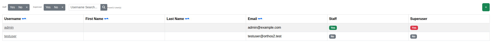

****************************************
Users
****************************************

.. note:: This page is only visible to you if you have administrator rights.

The Users page lets administrators manage Orthos 2 user accounts.

- Username, First Name, Last Name, Email
- Staff / Superuser: Badges indicating elevated permissions.

You can filter the list by username/email/name, staff status or superuser status. Opening a user shows their
reservations and API tokens, and lets you reserve a machine on their behalf, deactivate their account, or send them
a password reset email. New accounts are created without a usable password until the user resets it themselves (or
logs in via OIDC). See :doc:`../adminguide/groups_and_users` for background.
