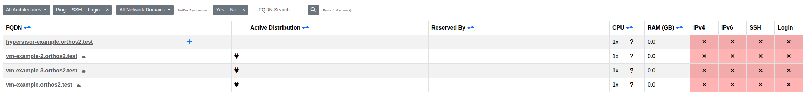
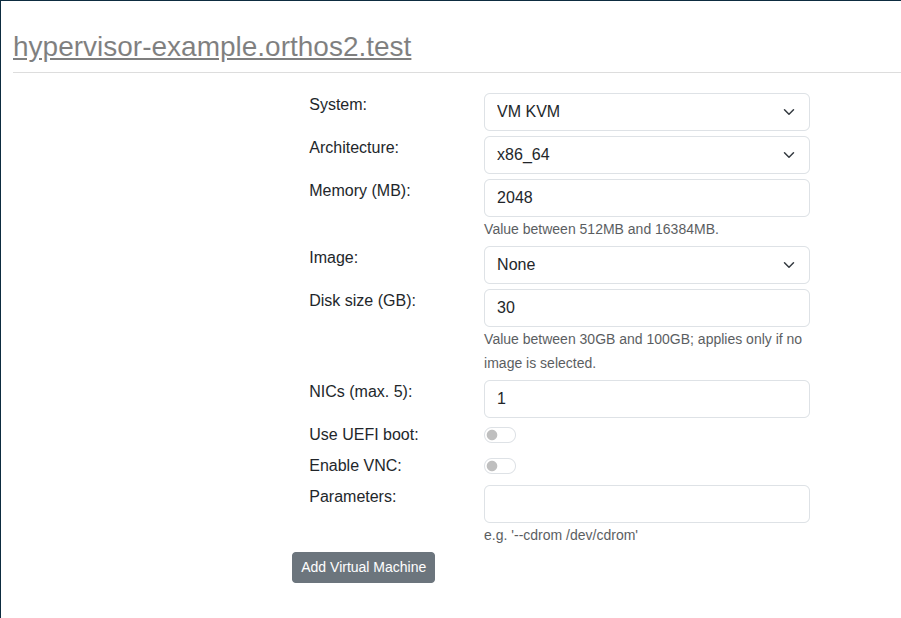

****************
Virtual Machines
****************

In Orthos it is possible that you work with virtual machines. You can work with a virtual machine as well as with a
bare metal machine. You can use the Power Cycle and access the console.

The Virtual Machines page lists every VM host together with its VM guests (marked with a cloud icon). Click the plus
(+) next to a VM host to create a new VM guest on it.

Choose the System, Architecture, Memory, Image, Disk size and number of NICs for the new guest, optionally enable
UEFI boot or VNC, and add any extra command line parameters (e.g. ``--cdrom /dev/cdrom``). Click "Add Virtual
Machine" to create it. Once created, the new VM guest is reserved under your name and appears under My Machines.
